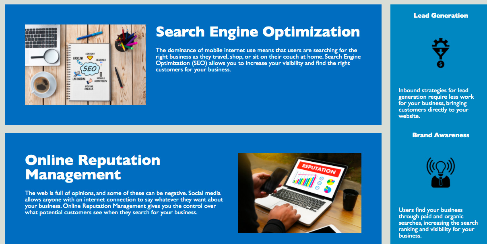
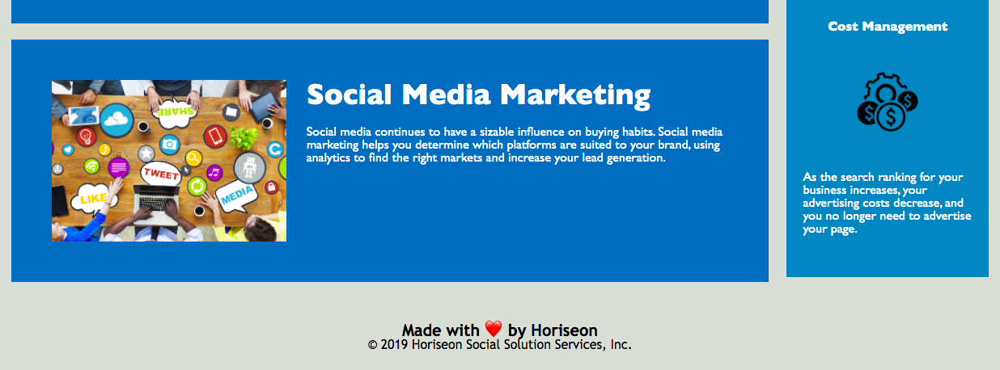

# HomeWork-1

## HW 1 Description
This webpage was created with the intention of informing the user of the company specializations, which are:
- Search Engine Optimization 
- Online Reputation Management 
- Social Media Marketing

The navigation bar:
- Intended to link to 3 company-specialization functions in the website below.
- This website was created to be a store of information and showcase Horiseon's business aptitudes.
- This html and css file created a clear semantic structure that is easy for a user to follow as well as inspect the script. 
- Through this activity I learned how to properly organize an html and css file to make it easy for the end user to understand. As well as GitHub best practices.

## Table of Contents
- [Installation](#installation)
- [Usage](#usage)
- [Credits](#credits)
- [License](#license)
## Installation
Clone or download this repository on GitHub then open "HomeWork-1/02-Homework/Develop/index.html" in a browser.   
## Usage
The navigation bar includes three links to more information regarding Horiseon's company specializations. As well as a side bar with Lead Generation, Brand Awareness, and Cost Management information.

## Credits
Initial assets and templates provided by UPenn and Trilogy. Shoutout to our instructor Anthony and TA Tom as well!

## License
© 2021 Trilogy Education Services, LLC, a 2U, Inc. brand. 
Confidential and Proprietary. All Rights Reserved.
---